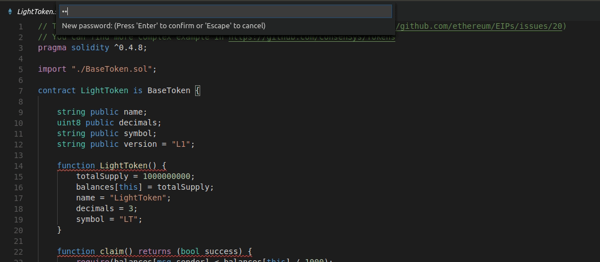
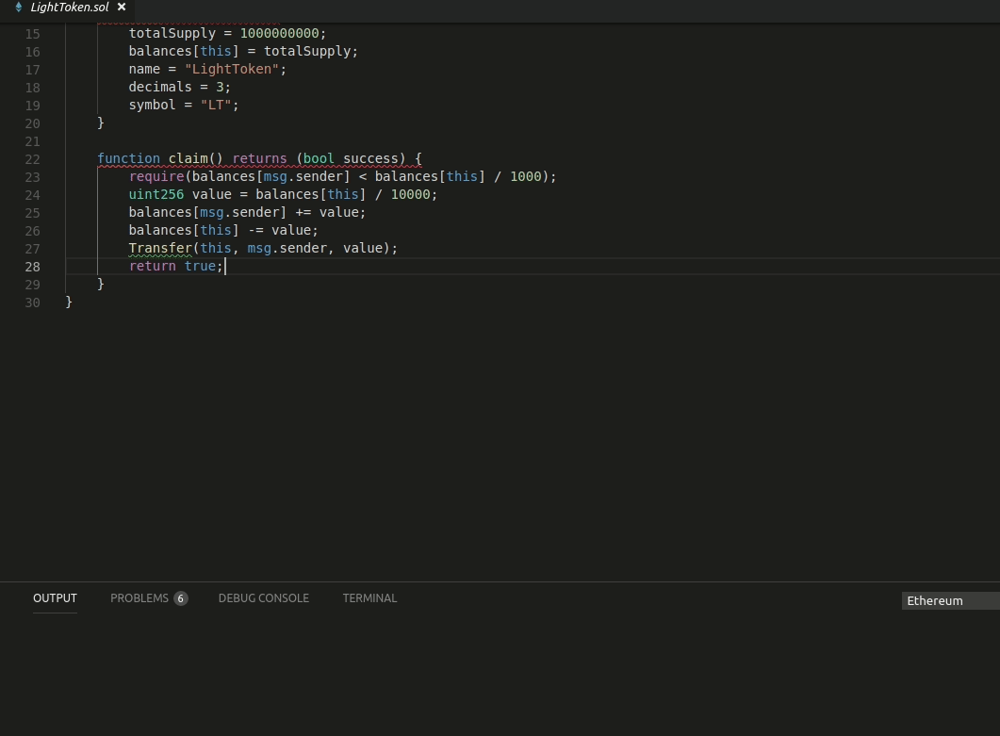
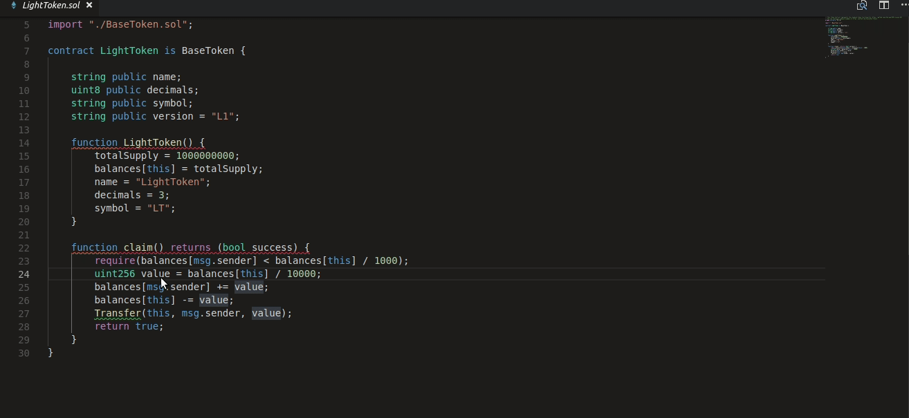
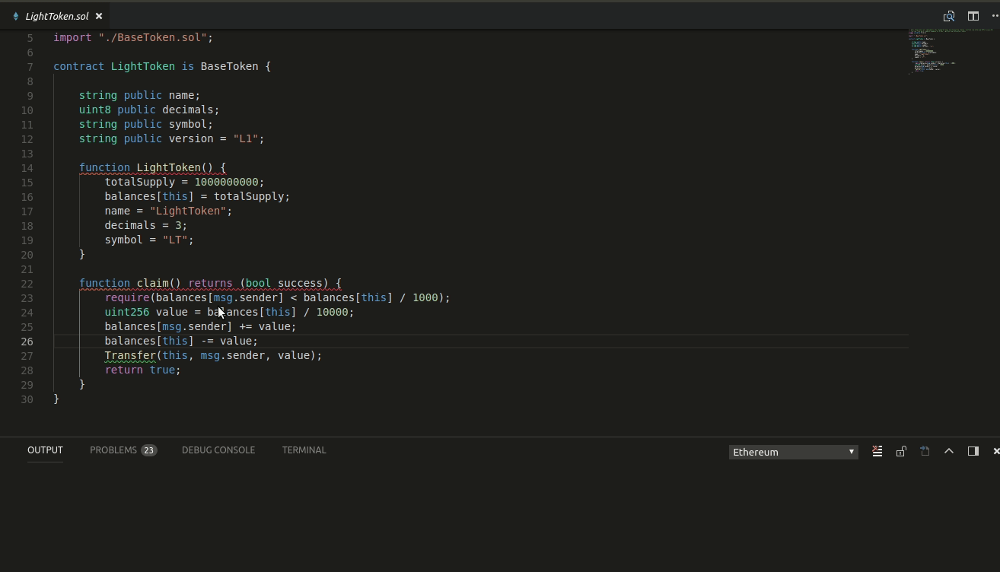

# Development
For detailed explanation, how to build project, go this link: 
* https://github.com/iolitelabs/vscode-plugin-top


# Iolite Languages and Solidity support for Visual Studio code, this extension provides


## Iolite ecosystem, provides all facilities to complete smart contract test and deployment, without leaving Visual Studio Code IDE

* managing private wallet
* deploying contract to different blockchain networks


## Solidity is the language used in Ethereum Technology to create smart contracts

* Syntax highlighting
* Snippets
* Compilation of the current contract (Press F1 Solidity : Compile Current Solidity Contract), or F5 
* Compilation of all the contracts (Press F1 Solidity : Compile all Solidity Contracts), or Ctrl+F5 / Cmd+F5
* Code completion for all contracts / libraries in the current file and all referenced imports
* Default project structure (solidity files needs to be in the 'src' directory, and libraries in the 'lib' directory). Libraries will follow the same structure.
* Compilation supporting EIP82 (dappfile and dependency packages)
* Support for different solidity versions (Remote and local)
* Code generation using https://github.com/Nethereum/abi-code-gen, it includes currently the default template for Nethereum service, dtos generation. 
  (Open 'contractName.json' after compilation from the bin folder. Press F1 and press Solidity: Code generate from compilation output..)
  Please contribute more templates.
* Linting using Solhint or Solium


## Default project structure

A default project  / library dependency structure is supported as follows:


Libraries will have the same name as their folder they are included.
Solidity files will be in the 'src' folder.
Libraries will be included in the 'lib' folder.

Currently there is no name conflicting resolution, so the first library found matching a name, will be the first one used.

## Code completion

Just press Ctlr + Space or Command + Space to autocomplete statements, currently supported all the storage variables, functions and events (with snippets) included in the current document and every document in the import chain. Also supported all the global variables, global functions, types and units.


## Auto compilation and error highlighting

Auto compilation of files and error highlighting can be enabled or disabled using user settings. Also a default delay is implemented for all the validations (compilation and linting) as solidity compilation can be slow when you have many dependencies.

```
"solidity.enabledAsYouTypeCompilationErrorCheck": true,
"solidity.validationDelay": 1500
```

## Linting

### Solhint

To lint Solidity code you can use the Solhint linter https://github.com/protofire/solhint, the linter can be configured it using the following user settings:

```json
"solidity.linter": "solhint",
"solidity.solhintRules": {
  "avoid-sha3": "warn"
}
```

This extension supports `.solhint.json` configuration file. It must be placed to project root 
directory. After any changes in `.solhint.json` it will be synchronized with current IDE 
configuration. 

### Solium

Solium is the default linter of supported by the extension https://github.com/duaraghav8/Solium, you can configure it using the following user settings:

```json
"solidity.linter": "solium",
"solidity.soliumRules": {
    "quotes": ["error", "double"],
    "indentation": ["error", 4]
},
```

soliumrc.json support will be included in the near future, for specific project linting requirements.

## Wallet Actions

Plugin also supports actions that require embedded wallet. Wallet private key is encrypted and you must supply password for encryption/decryption.

First time in Visual Studio session when you want use action, that require wallet, you will be prompted for password. If it's your first such action you will be prompted to enter new password



### Get Balance

You may request current balance of your wallet



### Deploying contract

You may deploy contract to Ethereum blockchain, using your wallet. Your contract must be already compiled and you must have some ether to do that.



### Calling a method

You may call a method of already deployed contracts.

